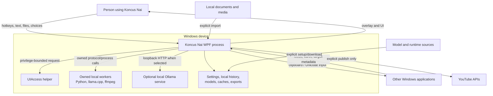
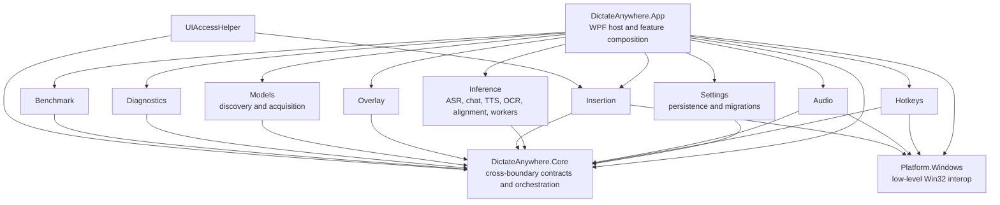
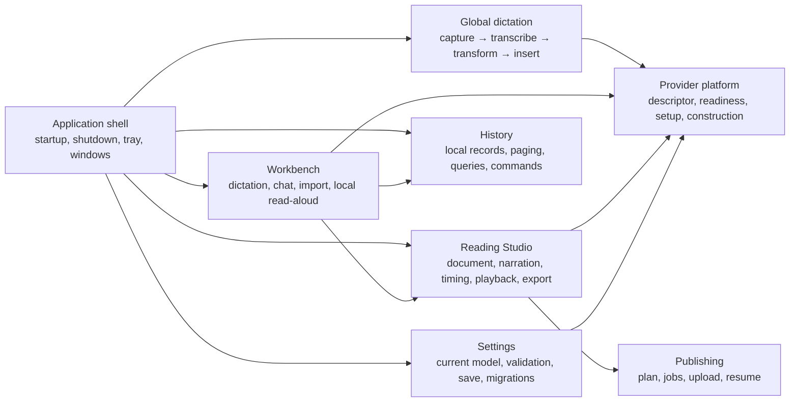
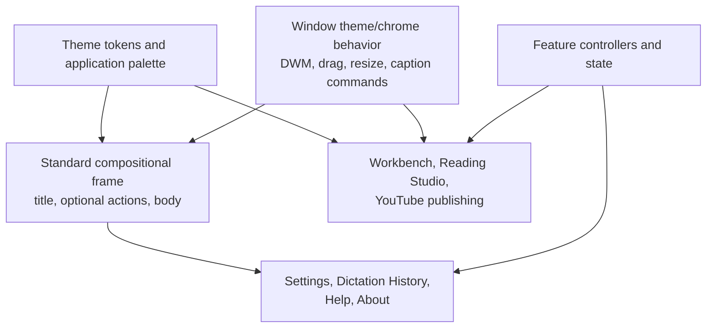
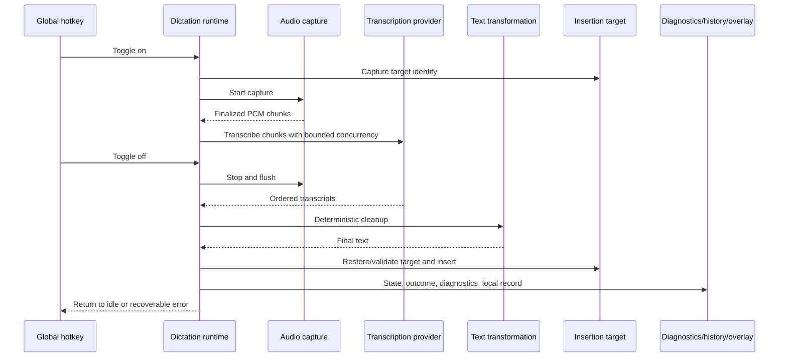
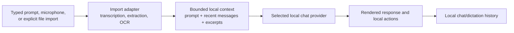
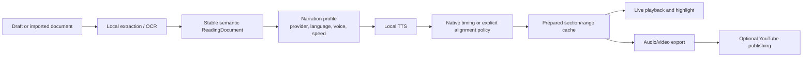
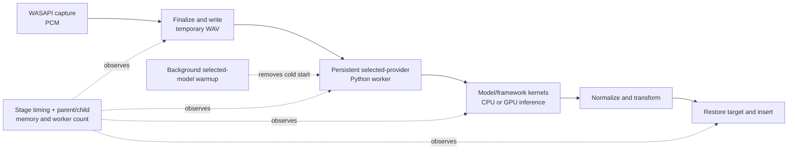

# Koncus Nai system architecture

## Why this document exists

This is the canonical, context-efficient map of the current Koncus Nai system and its intended ownership boundaries. It is written for engineers, reviewers, and AI agents that cannot load the entire repository.

Read this document before changing a cross-cutting workflow. Use
`docs/documentation-map.md` to find the canonical owner for a fact,
`docs/architecture/product-capability-matrix.md` for supported product behavior,
and `planning/codebase-hardening-backlog.md` for hardening scope and status.

## Product in one paragraph

Koncus Nai is a Windows 11 local-first desktop application with four primary capabilities: global microphone dictation into other applications, a unified local dictation/chat workbench, Reading Studio for local document extraction/OCR/narration/alignment/playback/export, and always-on local dictation/chat history. Network access is reserved for explicit model/runtime acquisition, local loopback model servers, and optional YouTube publishing. The historical `DictateAnywhere.*` namespace and assembly names remain compatibility identifiers.

History uses plaintext local versioned JSONL with no app password, enable switch, automatic retention, or encrypted-history compatibility path.

## System context

### Trust and privacy boundaries

- Microphone audio, dictated text, imported documents, OCR, chat prompts, narration, and alignment stay on the device during normal local workflows.
- Model/runtime downloads cross the network only during explicit setup or acquisition.
- Ollama communication is local loopback. Koncus Nai may stop only an Ollama process it started and ownership-tracked.
- YouTube receives video and metadata only after an explicit publishing action.
- UIAccess does not bypass Windows security. It is a separately packaged, signed, narrowly scoped helper subject to UIPI and integrity boundaries.
- Diagnostics must not persist raw user audio or text by default.
- Target history privacy relies on the signed-in Windows account and filesystem permissions, not an application password. Local plaintext history must remain excluded from diagnostic bundles unless the user explicitly exports it.

## Current production dependency graph

Arrows mean “may reference.” `App` is intended to be the only composition root.

### Dependency invariants

1. `Core` must not reference App or implementation modules.
2. `Platform.Windows` remains infrastructure-only and does not reference Core.
3. Implementation modules depend inward on Core contracts and on Platform only for required Windows interop.
4. Production UI must consume contracts/feature controllers, not implementation-module namespaces or static service factories.
5. The project graph must remain acyclic and match `docs/architecture/project-reference-guardrails.json`.
6. `Core` public surface is restricted to multi-boundary domain contracts, pipeline orchestration, and cross-cutting abstractions. Implementation details, provider registration metadata, and single-consumer presentation types are owned by their respective modules (`DictateAnywhere.App.Runtime`, `DictateAnywhere.App.Workbench`, `DictateAnywhere.App.History`).
7. A new project requires an independent dependency, deployment, security, or lifecycle reason. File count alone is insufficient.

The project graph is currently healthy and acyclic. `ApplicationComposition` is the application composition root; production windows receive dependency bundles and do not call static service factories. `RuntimeServiceFactory` remains an implementation construction helper used by composition/runtime owners, not a UI service locator. The [public API and dependency contract](public-api-and-dependency-contract.md) baselines the compiled surface and assembly evidence for all reusable libraries and executable roles; `CorePublicSurfaceTests` and the project-reference guardrail retain their narrower Core-ownership and layer-policy responsibilities.

## Feature ownership map

The following is the intended modular-monolith ownership model inside the WPF application. It describes responsibility, not necessarily separate assemblies.

### Ownership rule

Each feature owns its workflow state, arbitration, cancellation, and application policy. WPF windows and controls render immutable/view-model state and forward user intent. Infrastructure adapters own operating-system, process, filesystem, media, or network mechanics.

### Workbench boundary

`ApplicationComposition` constructs the Workbench graph and passes it through `WorkbenchDependencies`. `WorkbenchSettingsApplicationController`, `WorkbenchHistoryInteractionController`, the dictation/chat/import/read-aloud command controllers, and their typed operation sessions own workflow state, persistence coordination, cancellation, resources, and recovery policy. History stores remain behind `WorkbenchHistoryController` and the existing query/command coordinators. `WorkbenchPresentationReducer` deterministically derives the sole control-enablement and visibility projection from those authoritative states.

`TextboxWorkbenchWindow` is the top-level WPF lifetime and rendering boundary: it owns theme resources/subscription, dialogs, file picker/export/clipboard interactions, cross-view event routing, and controller/view disposal. The Workbench views own only cohesive control presentation, render-event suppression, WPF timers or deferred layout work, and narrow user-intent events. The detailed owner/test map and the audited code-behind size exception are recorded in `planning/workbench-wp03-ownership-inventory.md`.

### Shared window-shell boundary

First-party windows share visual and platform mechanics, not workflow state. The reuse boundary is deliberately small:

The standard frame may be reused by ordinary windows. Specialized windows consume the same tokens and behavior without inheriting workflow hooks from a base window or being forced into an identical layout.

## Primary runtime flows

### Global dictation

Global dictation state is `Idle → Recording → Transcribing → Inserting → Completed → Idle`; active stages may enter `Error`, and recovery must return to `Idle`. The runtime must serialize hotkey signals and never begin two sessions concurrently.

### Workbench chat and import

Only one completion/model-setup operation may own the chat surface at a time. Context size is bounded. Provider/model identity must travel with each request; a language or model name must not implicitly select a provider.

### Reading Studio

Reading invariants:

- Document sections are semantic and independent of viewport/DPI reflow.
- Narration cache identity includes every input that can change speech or timing.
- Appearance-only changes may reuse prepared narration; language, voice, speed, provider, model, timing policy, or source changes may not.
- Live playback and video export use the same tokenization, timing interpretation, typography, and highlight policy.
- Estimated timing is never presented as exact or audio-grounded.
- Grapheme clusters and logical text order are never split or reordered by highlighting/export.

`ReaderPreparationController` owns current-section and selected-range preparation requests, the
`ReaderOperationSession` preparation lease, request generations, narration/prefetch selection,
timing acquisition, media-open sequencing, cancellation, and safe completion/failure policy.
`ReaderPlaybackSession` remains the sole range/prepared-playback owner,
`ReaderNarrationSession` remains the narration/timing-cache owner, and
`ReaderNarrationPrefetchSession` remains the single next-section buffer. `ReaderWindow` captures
immutable requests and renders typed state/results; primary WPF playback is isolated behind
`IReaderPlaybackMedia` and its preparation-controller-owned `WpfReaderPlaybackMedia` implementation.

`ReaderExportController` owns immutable audio/video export commands, the shared export leases,
ordered narration/timing preparation, typed progress, cancellation, safe failure outcomes, and
same-destination temporary artifacts that are committed only after success. `ReaderPublishingController`
owns source snapshots, recovery compatibility, publishing workspace/job construction, the shared publish
lease, and atomic episode rendering. `YouTubePublishingCoordinator` retains the ordered upload transaction,
including bounded transient retry and serialized, awaited resumable-upload checkpoints.

`ReaderPresentationReducer` is the UI-independent source of Reader enablement, visibility, primary status,
and progress presentation. `ReaderSidebarView`, `ReaderDocumentView`, and `ReaderTransportView` own their
control-specific selection suppression, page/editor/highlight rendering, timers, accessibility metadata,
and seek suppression respectively. They emit typed intent and do not call workflow controllers or own
operation leases. `ReaderWindow` remains the top-level WPF coordinator for cross-view routing, file/modal
presentation, playback-media commands, completion presentation, chrome, and deterministic shutdown.

The final UI-002 ownership audit records one authority for each mutable Reader concern:

| Concern | Authoritative owner | Consumers and lifetime/cancellation evidence |
| --- | --- | --- |
| Document and draft transactions | `ReaderDocumentSession` | Window-lifetime session consumed by the coordinator/document view; draft generations reject obsolete previews. |
| Selected range and prepared playback | `ReaderPlaybackSession` | Window-lifetime session consumed by preparation and playback coordination; invalidation clears prepared state without duplicating range truth. |
| Reader operation arbitration | `ReaderOperationSession` | Window-lifetime owner of mutually exclusive preparation/import/export/publish leases; lease cancellation and disposal release the operation. |
| Preparation command, generation, progress, and failure policy | `ReaderPreparationController` | Per-window controller; cancellation/newer generations reject stale narration, timing, media-open, readiness, playback, notification, and prefetch effects. |
| Export command and artifacts | `ReaderExportController` | Per-window controller; owns export lease/task, typed progress, cancellation, same-destination temporary artifact, atomic commit, cleanup, and safe result. |
| Publishing recovery and command | `ReaderPublishingController` | Per-window controller; owns recovery compatibility, job/workspace construction, publish lease/task, rendering coordination, cancellation, and safe result. |
| Upload checkpoint/retry transaction | `YouTubePublishingCoordinator` | Publishing-controller dependency; serialized checkpoints are observed and awaited, retries are classified and bounded, and the journal is resumable. |
| Narration/timing cache and alignment | `ReaderNarrationSession` | Per-window owner of content/profile/audio-aware cache identity and alignment lifetime; controllers borrow it until they have stopped. |
| Next-section prefetch | `ReaderNarrationPrefetchSession` | Per-window owner of the single buffered task/cancellation pair; preparation decides when to consume, replace, or begin it. |
| Voice-preview preparation / preview media | `ReaderVoicePreviewSession` / `ReaderSidebarView` | The session owns preparation generation/cancellation; the sidebar owns and disposes only the WPF preview player and its handlers. |
| Primary playback media | `ReaderPreparationController` through `IReaderPlaybackMedia` | The window creates the dispatcher-bound adapter, the controller owns/disposes it, and the window only issues playback commands and observes events. |
| Enablement, major visibility, status, and progress | `ReaderPresentationReducer` | Pure immutable projection rendered by the window and three views; `ReaderOperationKind` is the busy/progress precedence and draft mode overrides all reading surfaces. |
| Sidebar/document/transport WPF mechanics | Respective cohesive view | Selection suppression; rendering/highlight/debounce timers; and seek suppression remain view-local, unsubscribe, and dispose with the view. |
| Dialogs, chrome, cross-view routing, import, and shutdown | `ReaderWindow` | Top-level WPF boundary; owns the import lease/task, observes draft-preview and sidebar-intent continuations, rejects callbacks after disposal, and coordinates dependency-ordered shutdown. |

Reader shutdown first rejects new intents, cancels the window-lifetime token and active import, and
stops preview/playback callbacks. It then unsubscribes and disposes the views, cancels all command and
prefetch owners, awaits import and draft preview work, disposes export/publishing/preparation controllers,
awaits prefetch and remaining sidebar-intent continuations (including voice preview), disposes operation
and completion UI state, and only then disposes narration/alignment, speech, and OCR resources. Queued
dispatcher callbacks re-check disposal before mutating presentation.

Focused evidence is in the matching `ReaderDocumentSessionTests`, `ReaderPlaybackSessionTests`,
`ReaderOperationSessionTests`, three `Reader*ControllerTests`, narration/prefetch/preview session tests,
`ReaderPresentationReducerTests`, `ReaderCohesiveViewTests`, and `ReaderWindowInitializationTests`.
`ReaderTimingResolverTests`, `ReadingTextLayoutTests`, Unicode segmentation tests, live-highlight and
video-export tests prove the shared rendering policy; UI/background guardrails protect dependency and
task ownership. WP-08 passed 166 Reader-filter tests and 869 full Release tests, with only the 2 existing
hardware/model skips. The 921-line code-behind and 433-line XAML retain an explicit size exception for
the top-level responsibilities above, not duplicated workflow state. Midnight is the no-selection default;
explicit supplied themes are preserved, but there is no persisted Reading Studio theme setting.
Manual playback, voice, video/upload, accessibility, keyboard-only, locale, DPI, and hardware checks remain
separate evidence gates; automated STA/render tests are not claims of those manual checks.

## State and lifetime model

| Lifetime | Examples | Owner |
| --- | --- | --- |
| Process | settings store, diagnostics, shared model manager/readiness, tray host | Application host/composition root |
| Window | Workbench/Reader/History controllers, WPF media adapters, subscriptions | Window coordinator/window |
| Session | dictation, chat completion, narration preparation, export, publish job | Named feature session/controller |
| Operation | streams, temp files, process request, cancellation source | The async operation that creates it |
| External owned process | Python worker, llama.cpp, ffmpeg, KoncusNai-started Ollama | Explicit process supervisor |

Every owner must observe exceptions, cancel where safe, and dispose deterministically. Fire-and-forget work is permitted only behind a named, exception-observing lifetime boundary.

## Persistence and data ownership

| Data | Owner | Required behavior |
| --- | --- | --- |
| Current settings | Settings module | Atomic save, supported migrations, non-destructive future-version handling |
| Dictation history | History feature | Always-on local records, paged query, edit/delete, corruption isolation, serialized file access; no automatic deletion |
| Chat history | History feature | Always-on local records, paged query, rename/delete, corruption isolation, serialized file access; no automatic deletion |
| Model/runtime assets | Models/provider setup | Version/provenance/integrity metadata and explicit acquisition |
| Narration/timing/previews | Reading feature | Content/provider/policy-aware keys, versioned cache, safe eviction |
| Publishing configuration/jobs | Publishing feature | Protected secrets, resumable versioned jobs, explicit upload |
| Diagnostics | Diagnostics module | Structured, bounded, redacted, locally exportable |
| Exports | Exporters/user-selected paths | Atomic completion or recoverable partial-file cleanup |

Unknown future persistence schemas must never be converted to defaults and overwritten. Legacy deserialization belongs in migration adapters; current runtime contracts must stay minimal.

### History storage invariant

Unlimited history means unbounded retention on disk—not unbounded UI queries or in-memory collections. Writes append through the versioned JSONL owner; edits and deletes use serialized streaming rewrites with atomic replacement. The current application does not inspect or delete files from the retired encrypted-history implementation.

## Transcription latency and process boundary

The persistent Python process owns the loaded selected model. Its memory is expected to be dominated by model weights, framework/runtime allocations, inference buffers, and accelerator state rather than the Python interpreter itself. The orchestration language may be changed only after stage measurements show it is material; inference runtime/model changes are evaluated independently.

## Provider model

A provider registration is the intended single source of truth for:

- Stable provider ID and display metadata.
- Operational/privacy classification.
- Supported capabilities and languages.
- Models, versions, resource requirements, and acquisition policy.
- Runtime readiness and repair/setup strategy.
- Service construction and owned lifetime.
- Supported fallback policy and diagnostic identity.

Settings, model management, readiness, runtime selection, and diagnostics must derive from this registration. They must not maintain independent catalogs that can drift.

## Failure policy

- Expected failures use typed results or typed exceptions with safe user messages.
- Cancellation is not logged or presented as an application defect.
- Retries are bounded and only for classified transient failures.
- Secure fields, blocked processes, privilege boundaries, and lost insertion targets remain distinct outcomes.
- Partial settings/history/export/publishing writes must be recoverable or ignored as incomplete.
- Worker protocol corruption, crash, or timeout must transition through one supervisor and never leave an unobserved task/process.

## Authoritative code entry points

| Concern | Start here |
| --- | --- |
| Application lifecycle/composition | `src/DictateAnywhere.App/App.xaml.cs`, `src/DictateAnywhere.App/Composition/ApplicationComposition.cs`, `src/DictateAnywhere.App/Lifecycle/ApplicationHost.cs`, `src/DictateAnywhere.App/Lifecycle/WindowCoordinator.cs` |
| Global dictation orchestration | `src/DictateAnywhere.App/Runtime/DictationRuntime.cs`, `src/DictateAnywhere.Core/Services/DictationPipelineCoordinator.cs` |
| Workbench | `src/DictateAnywhere.App/Workbench/WorkbenchPresentationState.cs`, workflow `Workbench*Controller.cs`/`Workbench*Session.cs` owners, and `TextboxWorkbenchWindow.xaml.cs` as the WPF boundary |
| Reading Studio | `src/DictateAnywhere.App/Workbench/Reading/ReaderPresentationState.cs`, `ReaderSidebarView.xaml.cs`, `ReaderDocumentView.xaml.cs`, `ReaderTransportView.xaml.cs`, workflow `Reader*Controller.cs`/`Reader*Session.cs` owners, and `ReaderWindow.xaml.cs` as the WPF coordinator |
| Settings/current migrations | `src/DictateAnywhere.Core/Contracts/AppSettings.cs`, `src/DictateAnywhere.Settings/JsonSettingsStore.cs` |
| Provider registration | `src/DictateAnywhere.App/Runtime/ProviderMetadata/`, `src/DictateAnywhere.App/Runtime/LocalTranscriptionProviderRegistry.cs`, `LocalChatProviderRegistry.cs`, `src/DictateAnywhere.Inference/TextToSpeech/ReaderTextToSpeechService.cs` |
| History | `src/DictateAnywhere.App/History/HistoryCommandCoordinator.cs`, `LocalDictationHistoryStore.cs`, `LocalChatHistoryStore.cs`, `VersionedJsonLinesFile.cs` |
| Window theme/chrome | `src/DictateAnywhere.App/Presentation/AppThemeManager.cs`, `WindowThemeBehavior.cs`, `WindowCaptionButtons.xaml`, and `docs/architecture/window-shell-inventory.md` |
| Insertion/Windows target safety | `src/DictateAnywhere.Insertion/WindowsTextInsertionService.cs`, `WindowsWindowFocusProvider.cs` |
| Worker infrastructure | `src/DictateAnywhere.Inference/Workers/PersistentPythonWorkerClient.cs` and capability-specific provider services |
| Build/release | `Directory.Build.props`, `Directory.Packages.props`, `.github/workflows/ci.yml`, `scripts/run-quality-suite.ps1`, `scripts/security-compliance.ps1`, `scripts/validate-documentation-claims.ps1`, `scripts/build-installer.ps1` |

## Known architectural debt

These are current facts, not target design:

1. Required manual shell, History, accessibility, DPI, screen-reader, microphone, model, and device evidence remains open. Automated/source inspection is not a substitute for these gates.
2. PERF-TRANSCRIBE-001 and PERF-TRANSCRIBE-002 are complete. Current evidence identifies model startup, inference, and CPU memory residency as the limiting boundary; bounded dependency-free thread/load candidates did not qualify for a production change.
3. WP-23 completes the repository's supply-chain enforcement boundary: one machine-readable provenance inventory, locked NuGet graphs, hash-locked Python inputs, immutable model/runtime identities, bundled asset checks, and commit-pinned CI actions. The optional Windows ROCm Indic Parler path remains fail-closed until a compatible exact wheel is reviewed; no unsupported reproducibility claim is made for it.
4. WP-26/WP-27 established the test taxonomy, focused runners, coverage floors, and controlled fault evidence. Broader source-shape cleanup remains subordinate to behavior and ownership rather than a standalone completion claim.
5. WP-13 records owners and callers for every executable in `planning/executable-ownership-and-distribution-audit.md`. WP-28 moved retained developer executables under `tools`, added explicit production/developer build filters, extended the complete project graph across `src` and `tools`, and made installer payload membership fail closed. App and UIAccess remain the only production executables.
6. WP-30 defines canonical fact owners in `docs/documentation-map.md` and validates current links, paths, required claims, manual evidence structure, and narrowly scoped retired claims. Historical plans remain explicitly classified records rather than competing current contracts.

The ordered remediation is in `planning/codebase-hardening-backlog.md`.

## AI/engineer context loading order

For most tasks, load only this working set:

1. This document.
2. `docs/guides/implemented-features.md` for product truth.
3. The relevant feature architecture note, if one exists.
4. The target production files and their focused tests.
5. `planning/codebase-hardening-backlog.md` only when the change is refactoring/hardening work.
6. Release/security documents only when the change crosses those boundaries.

Do not load all planning and release documents by default. Treat dated plans and generated reports as historical evidence unless a canonical document links to them.

## Change checklist

Before changing a cross-boundary workflow, answer:

1. Which feature owns the state and lifetime?
2. Which invariant changes?
3. Which boundary contract changes, if any?
4. Does this introduce a second source of truth or silent fallback?
5. What happens on cancellation, repeated input, shutdown, partial write, or worker failure?
6. What test and operational evidence proves the behavior?
7. Which product, architecture, security, or release document must change with it?
